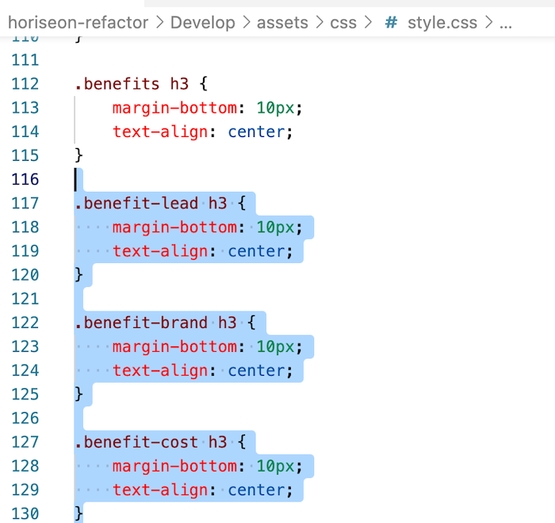
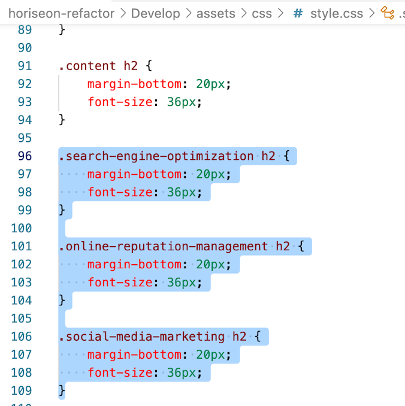

# Horiseon Refactor

## Bootcamp Challenge 1

Repository for the website files for the week 1 challenge of UofM coding bootcamp

## Table of contents
* [General info](#general-info)
* [Technologies](#technologies)
* [Examples](#examples)
* [Setup](#setup)

## General info
The assignment was to refactor the starter code given to increase accessibility and get rid of unnecessary code. Here is a screenshot of the resulting webpage (visually unchanged). 

## Examples
Here are two examples of refactored CSS code  

## Technologies
Project is created with:
* HTML
* CSS
	
## Setup
To see this project, checkout this repo you're in, and to see the website click [here](https://mwegter95.github.io/horiseon-refactor/).
